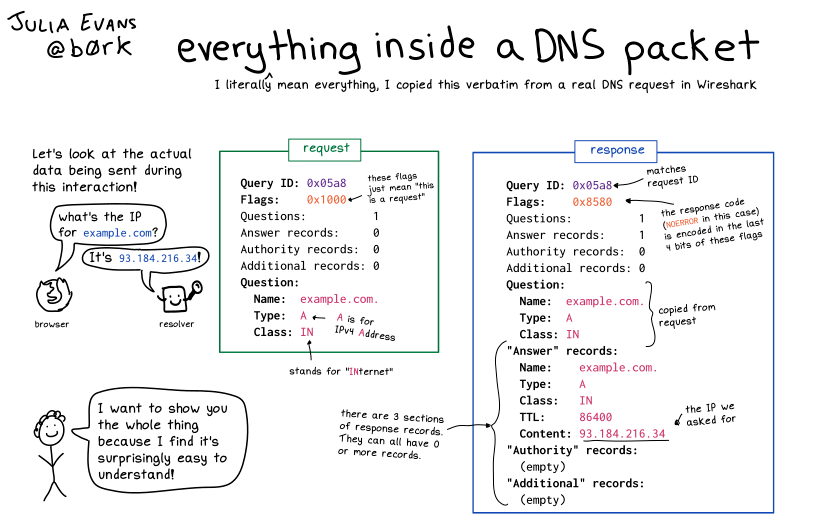

## (Maybe Obvious) Preamble

### What is DNS?
> Wife: What's DNS?
>
> Me: It's that thing you use every day when you browse the web on your phone.
>
> Me: actually even when you don't use your phone you use DNS!
>
> Me: DNS is an invisible magical force all around us! (waves hands)
>
> Wife:
>
> 


In a nutshell, DNS, or [Domain Name System](https://en.wikipedia.org/wiki/Domain_Name_System) is a system used by computers to translate domain names (e.g. `example.com`) to their corresponding IP address, which is mapped to a server hosting the content you want to view[^1]. This request happens before your computer can talk to the server directly and request the specific page you are trying to view.

The most common DNS servers in use are usually run by Internet Service Providers (ISPs), and that's the default for most internet users who haven't customized their settings. If your work's network is tightly controlled, often that is done by the company setting the DNS of the corporate network / VPN to their own DNS server.

## Why should I care?

### Censorship, Security and Privacy Considerations
What makes DNS important is that it allows private companies such as ISPs and by extension governments to censor the websites you can access. If for example the ISP, by request of the government, or for other reasons, decides that they no longer want you to access [https://freedom.press](https://freedom.press), they can easily change their DNS server to point at another IP address, either an invalid one, or even more maliciously, their own version of the website with "state approved" content.

The Chinese Government infamously uses DNS spoofing to censor the [internet in their country](https://en.wikipedia.org/wiki/Internet_censorship_in_China#Technical_implementation) and preventing their citizens from reading about [certain targeted topics](https://en.wikipedia.org/wiki/Internet_censorship_in_the_People%27s_Republic_of_China#Targets_of_censorship).

Similarly, hackers often use DNS, which is an unencrypted protocol, to not only track those around them, but also to redirect their traffic to a maliciously crafted websites. So if you are on a network you don't control (e.g. public WIFI or a fake network pretending to be a public WIFI 😉), the hacker can redirect `yourbank.com` to a VERY convincing copy of your bank's login page and steal your credentials[^2].

<iframe width="560" height="315" src="https://www.youtube-nocookie.com/embed/EbetD2LMbeQ" title="YouTube video player" frameborder="0" allow="accelerometer; autoplay; clipboard-write; encrypted-media; gyroscope; picture-in-picture" allowfullscreen></iframe>


Moreover, every time you access a website, either directly, or indirectly (some script on your computer requests a website), the DNS server can keep a record of your computer's IP and the requested domain. This data is routinely [collected and often sold](https://arstechnica.com/information-technology/2017/03/how-isps-can-sell-your-web-history-and-how-to-stop-them/). This harms your privacy because this type of metadata can help companies and governments build a profile cataloging what type of websites you visit, when, and how often. It can also be used to identify and "weed out" political dissidents.

Don't get me started with the "[But](https://spreadprivacy.com/three-reasons-why-the-nothing-to-hide-argument-is-flawed/) [I](https://en.wikipedia.org/wiki/Nothing_to_hide_argument) [have](https://www.amnesty.org/en/latest/campaigns/2015/04/7-reasons-why-ive-got-nothing-to-hide-is-the-wrong-response-to-mass-surveillance/) [nothing](https://www.youtube.com/watch?v=Qn-YEvFi0Ew) [to](https://www.youtube.com/watch?v=cNb9riPyqzs) [hide](https://www.schneier.com/blog/archives/2006/05/the_value_of_pr.html)" fallacy.

## Censorship, Security and Privacy Solutions
There are also other DNS providers that you can use that offer varying degrees of benefit over using the default ISP DNS. For example [Quad9](https://www.quad9.net/) (9.9.9.9) which is a more secure and privacy respecting DNS server than your ISP's DNS server (allegedly, because we should all be skeptics).

Finally, you can run your own DNS server using something like [Pi
Hole](https://pi-hole.net/). Pi Hole is a DNS server you can run on a cheap $10 computer [such as the Raspberry Pi Zero W](https://www.pishop.us/product/raspberry-pi-zero-w/) and use to block ads from every device on your local network. You can even use it on the go with your phone by [setting up a VPN](https://docs.pi-hole.net/guides/vpn/openvpn/overview/).

Blocking ads is also great not only for regaining control of your precious attention and privacy, but also for [speeding up web browsing](https://thetechieguy.com/ad-blocker-impact-internet-speed/), [reducing data usage on limited internet plans](https://www.nytimes.com/interactive/2015/10/01/business/cost-of-mobile-ads.html), [conserving battery](https://www.nytimes.com/2015/10/01/technology/personaltech/ad-blockers-mobile-iphone-browsers.html) while on the go and even [reducing CO2 emissions](https://www.sciencedirect.com/science/article/pii/S0195925517303505)!

There are many reasons why you might want to [run your own DNS server](https://jvns.ca/blog/2022/01/05/why-might-you-run-your-own-dns-server-/).

## So how does it work?

DNS is a request/response transaction or question/answer. Your computer asks `What's the IP for example.com?` and the DNS server answers `It's 93.184.216.34`. This is an over simplification.

[Julia Evans](https://twitter.com/b0rk) posted a really cool diagram/comic explaining the request/response cycle of a DNS request:

[](https://wizardzines.com/comics/dns-packet/)

### DIY
Want to see for yourself what's inside a DNS packet? Use the [dig](https://linux.die.net/man/1/dig) CLI, which is available on most Linux based systems:

```sh
dig example.com
```

The output should look like this:

```
; <<>> DiG 9.16.15-Ubuntu <<>> example.com
;; global options: +cmd
;; Got answer:
;; ->>HEADER<<- opcode: QUERY, status: NOERROR, id: 43827
;; flags: qr rd ra; QUERY: 1, ANSWER: 1, AUTHORITY: 0, ADDITIONAL: 1

;; OPT PSEUDOSECTION:
; EDNS: version: 0, flags:; udp: 65494
;; QUESTION SECTION:
;example.com.                   IN      A

;; ANSWER SECTION:
example.com.            6798    IN      A       93.184.216.34

;; Query time: 0 msec
;; SERVER: 127.0.0.53#53(127.0.0.53)
;; WHEN: Sun Jan 30 22:22:42 CST 2022
;; MSG SIZE  rcvd: 56
```

If you want to dig deeper (pun intended, deal with it!) combine `dig` with [jc](https://github.com/kellyjonbrazil/jc) and [jq](https://stedolan.github.io/jq/). After installing these tools, simply run:

```sh
dig example.com | jc --dig | jq
```

And you should get something looking like this:

```json
[
  {
    "id": 10267,
    "opcode": "QUERY",
    "status": "NOERROR",
    "flags": [
      "qr",
      "rd",
      "ra"
    ],
    "query_num": 1,
    "answer_num": 1,
    "authority_num": 0,
    "additional_num": 1,
    "opt_pseudosection": {
      "edns": {
        "version": 0,
        "flags": [],
        "udp": 65494
      }
    },
    "question": {
      "name": "example.com.",
      "class": "IN",
      "type": "A"
    },
    "answer": [
      {
        "name": "example.com.",
        "class": "IN",
        "type": "A",
        "ttl": 7030,
        "data": "93.184.216.34"
      }
    ],
    "query_time": 0,
    "server": "127.0.0.53#53(127.0.0.53)",
    "when": "Sun Jan 30 22:18:50 CST 2022",
    "rcvd": 56,
    "when_epoch": 1643602730,
    "when_epoch_utc": null
  }
]
```


## Keep reading: A few interesting topics related to DNS

### Handshake (HNS)
HNS is a cryptocurrency based, truly decentralized, censorship and tamper resistant TLD provider. It allows you to buy an entire class of domains e.g. `yourname.😍` and sell domains as a registrar.

Read more here: https://learn.namebase.io/about-handshake/about-handshake

### DNS over HTTPS (DoH)
Since DNS is not encrypted, anyone on a public network (think Starbucks Free WIFI), can listen in to your DNS requests - this is surprisingly easy to do. DNS over HTTPS uses the common SSL encryption available on most websites to encrypt the request response cycle and protects it from "Man-in-the-Middle" attacks]. Read more here: https://en.wikipedia.org/wiki/DNS_over_HTTPS

While some operating systems still don't support DoH natively, you can still set up DoH via a local proxy server such as [cloudflared](https://github.com/cloudflare/cloudflared) and [Pi Hole](https://docs.pi-hole.net/guides/dns/cloudflared/).

If you are using Firefox you can also [enable DoH in your browser](https://support.mozilla.org/en-US/kb/firefox-dns-over-https#w_manually-enabling-and-disabling-dns-over-https)[^3].

### Additional deep dives into DNS
Check out the rest of [Julia Evans' DNS articles](https://jvns.ca/categories/dns/).
Julia always does a great job explaining complicated topics succinctly!

[^1]: In reality, things can be bit more complicated in modern web hosting: an IP can point to a Load Balancer [LB], either hardware or software, and the LB can talk to a node in a cluster which contains the actual server software.

[^2]: Admittedly, these type of attacks are now somewhat harder with the advent of [HSTS](https://https.cio.gov/hsts/) and modern browsers, but they are still possible (not everyone uses HSTS and not every HTTP client respects HSTS or even guaranteed to verify SSL certificates - think cheap IoT devices).

[^3]: The caveats to using DoH built into Firefox are that it will only affect URLs visited in that browser, and if you use PiHole, DoH in Firefox will bypass any ad filtering done by the PiHole since the browser will communicate directly with the DNS provider instead of your local filter first.

