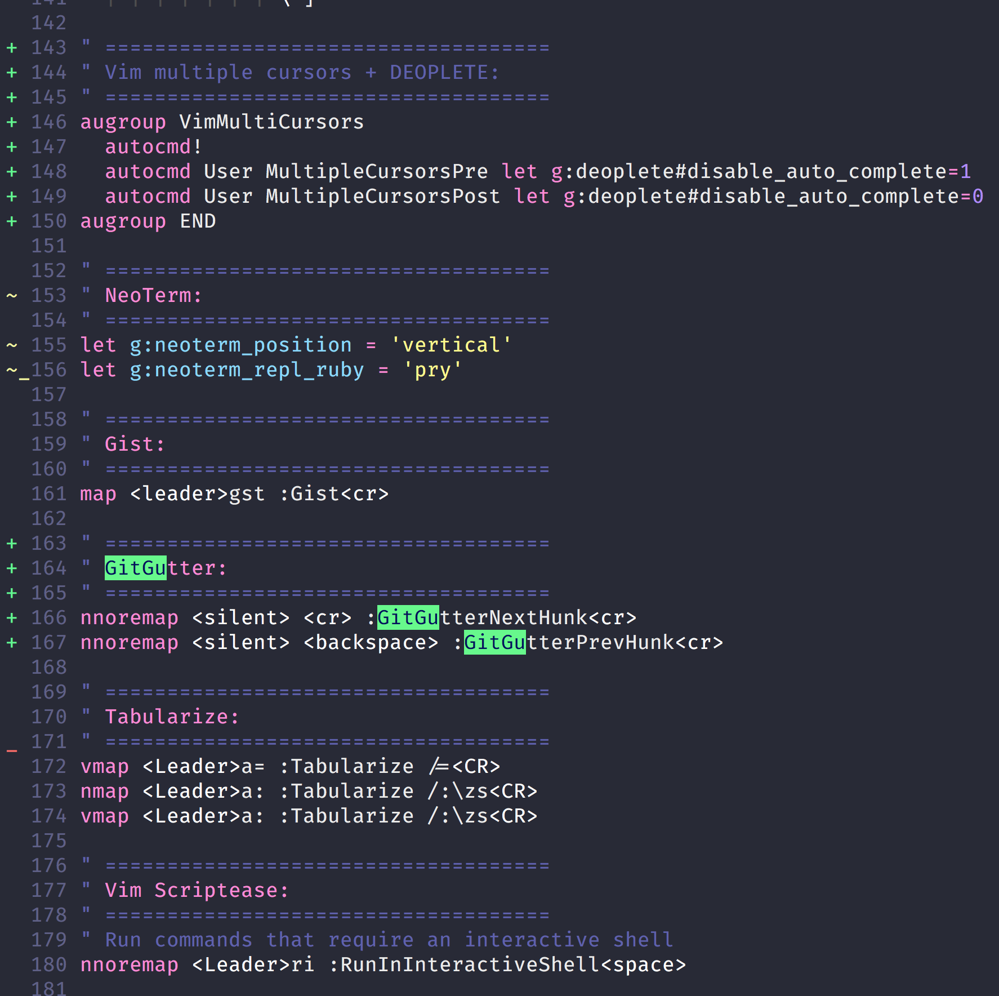

One of my favorite Vim plugins is [vim-gitgutter](https://github.com/airblade/vim-gitgutter) - it shows gutter markings for changes in the current buffer when that file is tracked by git.

It looks like this:


`+` = new lines
`-` = deleted line
`~` = changed line

It also comes with a few very useful commands for working with hunks, sections of changed code in your file.

To jump between hunks you can use `]c` and `[c`. Since I don't really use the `return` and `backspace` keys in normal mode I have mapped those instead:

```vim
nnoremap <silent> <cr> :GitGutterNextHunk<cr>
nnoremap <silent> <backspace> :GitGutterPrevHunk<cr>
```

This is especially useful on big files (more than a bufferful) with scattered changes.
