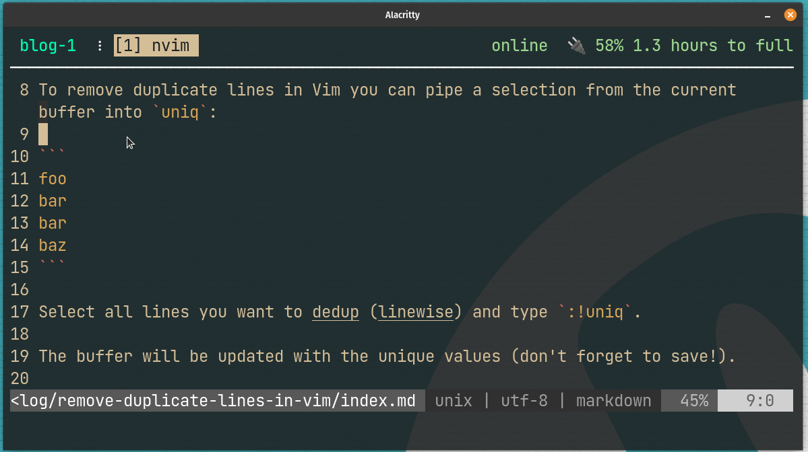

To remove duplicate lines in Vim you can pipe a selection from the current buffer into `uniq`:

```
foo
bar
bar
baz
```

Select all lines you want to dedup (linewise) and type `:!uniq`.

The buffer will be updated with the unique values (don't forget to save!).


