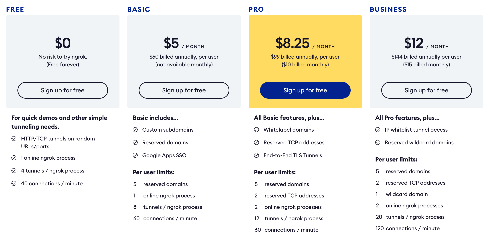

## Introduction - The Problem Ngrok Solves

Sometimes you may need to expose a service running on your local machine to the web. This can be useful for a multitude of reasons, such as: testing your chatbot, SSH access to your Raspberry Pi, building webhook integrations, exposing your local web server, testing on mobile devices, sending previews to clients, file sharing, etc..

In a modern network setup, routers group all the computers connected to the network behind one IP address, essentially shielding them from **incoming connections**. Not exposing your computer directly to the network has many security benefits: imagine having to secure every device you have connected to your network such as Smart TVs, Security Cameras, Smart Toaster, Smart Shoehorn etc. Most of these devices never upgrade their software/firmware, leaving your network vulnerable to hackers! That's not to say that a router protects you from every threat, but it certainly helps mitigate direct port scanning and exploitation of security vulnerabilities.

The traditional way of exposing a locally running service to the web was to open the router settings and configure port forwarding. This is still the solution for certain applications, such as allowing your gaming console to communicate on certain ports. The issue is that it isn't scalable: You can't expose multiple services on the same ports (e.g. 80/443), not all users have direct access to their router settings - think office workers on a corporate network, and you can't easily set up https access to a service - which requires a domain name and a wildcard SSL cert.

### That's Where Ngrok Comes In

Ngrok was one of the pioneering mainstream services to solve this issue in an elegant and easy to use way. They provide a simple command line tool that lets you type the port you want to expose and get a live url in seconds!

- Custom URL (limited to 3-5 subdomains per user, for paid plans only)
- Custom domain (on Pro and Business plans)
- HTTPS support out of the box
- Almost zero configuration
- Some enterprise solution

The initial version of Ngrok was free and open source, but at some point the developers decided to start charging for the service, and I don't blame them, they have a great product!

### Why self-host?

For the majority of developers, in particular less experienced folks, paying for Ngrok or other competing services is the right thing to do - you save yourself some headaches of provisioning, securing and maintaining a server dedicated to tunneling.

For advanced users who care about controlling their data and privacy, and don't want their connection passing through a 3rd-party server they don't have control over / or those who wish to understand how services like Ngrok work I suggest self-hosting.

Another factor is pricing! The self host setup is less than $4 a month (VPS monthly cost) + whatever time you put in setting it up / casually maintaining it as needed. In comparison, this is Ngrok's pricing scheme:

> Source: https://ngrok.com/pricing

As you can see, not much more expansive, but it has quite a few limitations on each plan. For example, if you want to use your own personal domain, that will set you back **$8.25/month**, and you'll still have some limitations on the number of connections per minute, number of tunnels, etc. To me that alone provided a good enough reason to consider self-hosting!

### The Solution: SirTunnel

The first thing to keep in mind is that there are many ways to accomplish what Ngrok done. In fact there's an [awesome repository out there full of them!](https://github.com/anderspitman/awesome-tunneling).

I've tried a few of those, many are SSH based and are simple to set up but have many limitations, other either unmaintained / or commercial / closed source.

The author of that repo has two projects that he created to solve this problem, the one we will look at today is [SirTunnel](https://github.com/anderspitman/SirTunnel).

SirTunnel is very small and relativly easy to understand. Here is the list of advantages listed in the project's README file:

* Minimal. It leverages [Caddy](https://caddyserver.com/) and whatever SSH server you already have running on your server. Other than that, it consists of a 50-line Python script on the server.  That's it. Any time you spend learning to customize and configure it will be time well spent because you're learning Caddy and your SSH server.
* 0-configuration. There is no configuration on the server side.  Not even CLI arguments.
* Essentially stateless. The only state is the certs (which is handled entirely by Caddy) and the tunnel mappings, which are ephemeral and controlled by the
  clients.
* Automatic HTTPS certificate management. Some other solutions do this as well, so it's important but not unique.
* No special client is required. You can use any standard SSH client that supports remote tunnels. Again, this is not a unique feature.

## Sold?! Let's Get Started

> Disclosure: some links below are affiliate links - when you use them it costs you nothing - in fact you'll get some free hosting credits! These helps me pay my hosting bills.

### Creating The Server on Vultr

The first thing you'll need to do is sign up for a VPS provider if you don't already have one. I recommend [Vultr (use this link for $100 towards your first month!)](https://www.vultr.com/?ref=8844284-6G) because it is very modern and complete provider, and their base servers are the cheapest I could find! Starting at only $2.50/month! (that's if all you need is IPv6, for our purposes we need IPv4 so we'll be using the $3.50/mo server).

After signing up with the link above, go to Products -> Cloud Compute -> New York (NJ) -> Ubuntu 20.10 x64 -> 10GB SSD for $3.50/mo

> That's pretty impressive for $3.50 and you can get a lot done with these specs!

Upload your ssh key. I prefer to generate a custom ssh key for each server I own, so that if one key is compromised it reduces the chances of other servers getting compromised.

