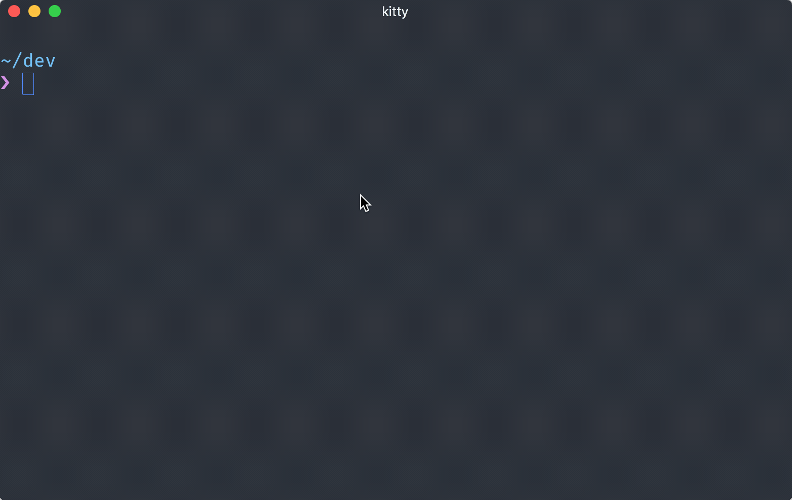
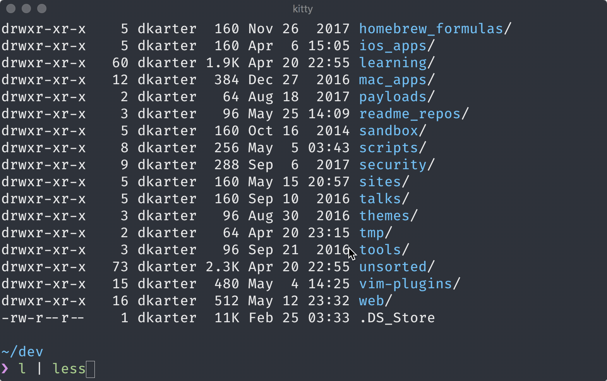
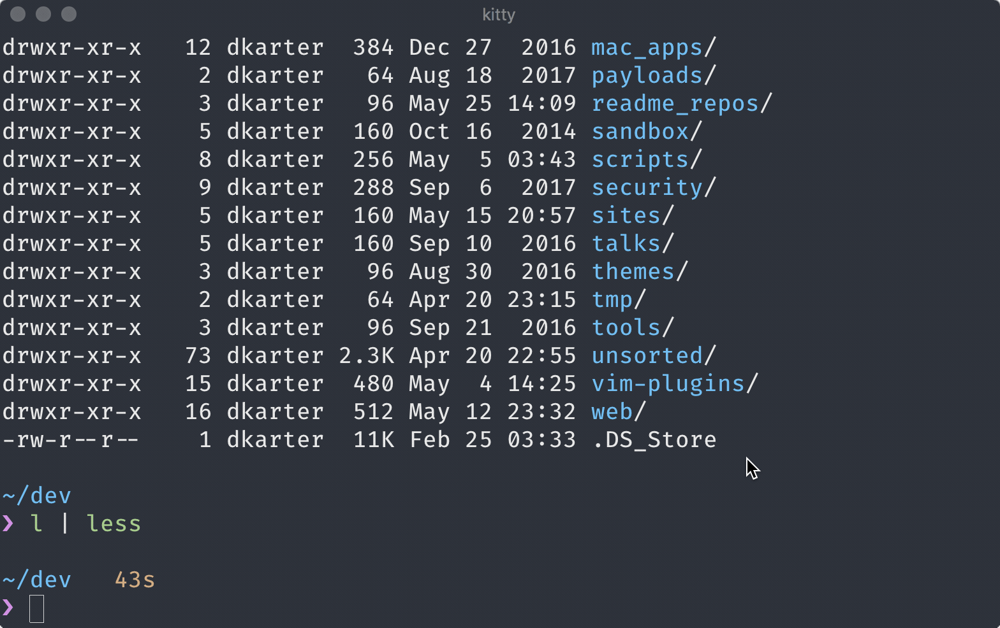

My ls command colors directories and files according to their type and permissions:

But when the window is too small to fit the content I pipe the result into `less`:

Which cannot correctly parse the escape code from ls and turn them into color. To fix that add `-r` to the less command:

Notes:
> My `l` alias is `gls -F -G --color --group-directories-first -lah` (`gls` is GNU ls)

> You can `alias less=less -r` if you want this to be the default behavior for less.
