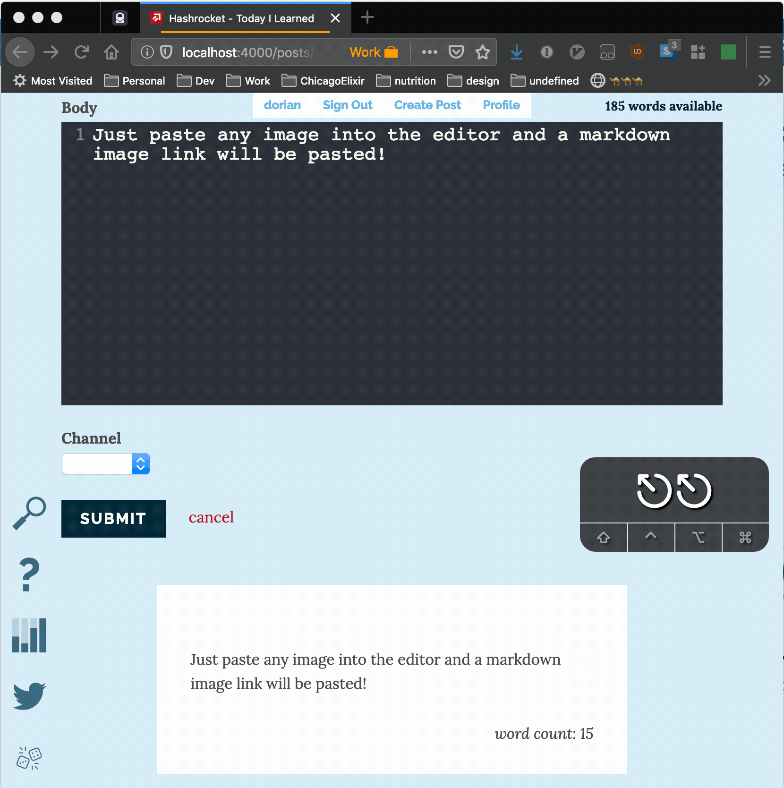

Browsers allow you to capture a `paste` event in a DOM element [[1]](https://www.w3.org/TR/clipboard-apis/#clipboard-event-paste)  [[2]](https://developer.mozilla.org/en-US/docs/Web/Events/paste).

This event fires before any clipboard data is inserted into the document, which makes it ideal for manipulating the data and pasting the manipulated data instead.

In [Today I Learned](https://til.hashrocket.com) by [Hashrocket](https://hashrocket.com) we recently utilized this feature to enable pasting images straight into the post editor. The image is then uploaded to [imgur.com](https://imgur.com) and the resulting URL is pasted as a Markdown Image Tag into the textbox.

If you are interested in adding similar functionality to your site check out [this PR](https://github.com/hashrocket/tilex/pull/337).

Also consider hosting your own fork of [TIL](https://github.com/hashrocket/tilex).
