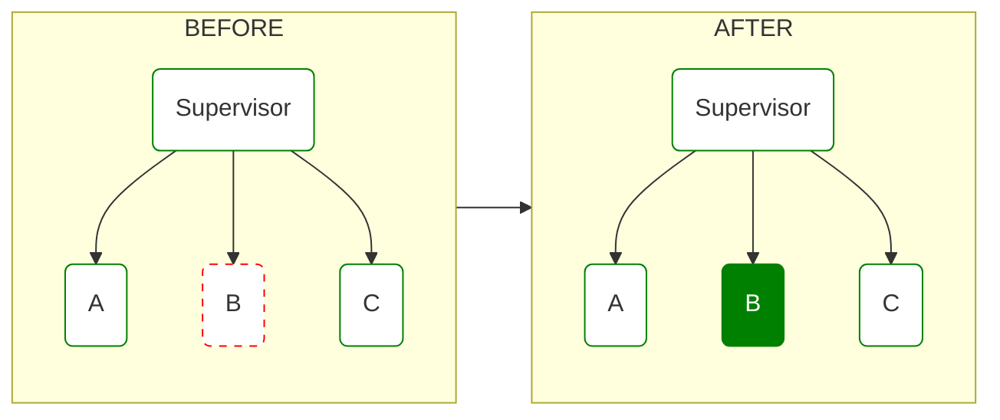
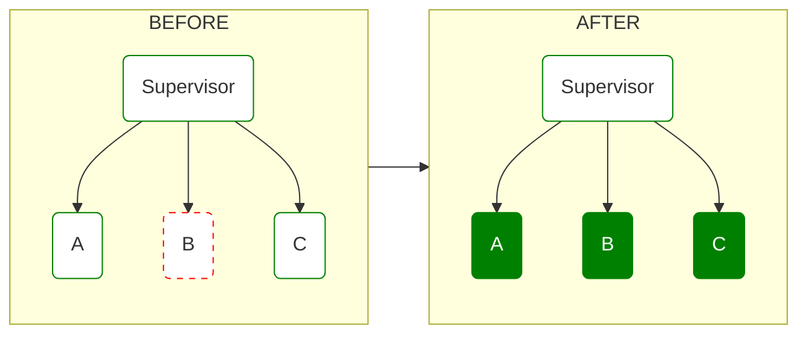
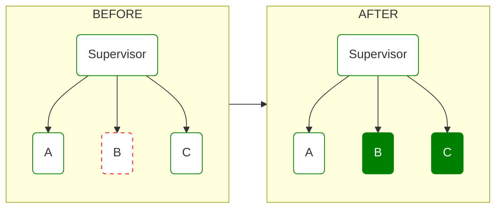

## Introduction

Seeking a hands-on way to further explore [Mermaid](https://mermaid.js.org/) — a remarkable JavaScript diagramming and charting tool — I decided to apply it to something familiar: visualizing OTP Supervisor strategies in Elixir. Mermaid's ability to render simple markup into great looking charts felt like an ideal fit for demonstrating these strategies.

The inspiration for this project came from the book [Concurrent Data Processing in Elixir by Svilen Gospodinov](https://amzn.to/3NB3fwI), which I highly recommend. Within its pages, I found a series of diagrams representing Supervisor restart strategies. I set out to recreate these diagrams using Mermaid and take the opportunity to add Mermaid support to my blog. Moreover, I thought it would be beneficial to provide real-life examples demonstrating the appropriate use-cases for each strategy.

Mermaid's support extends to GitHub Markdown as well, making it an invaluable tool for maintaining diagrams within source control. This allows diagrams to evolve alongside the code as the architecture changes over time (as opposed to a static/binary image). I encourage you to take a peek at the Mermaid code I've provided below each diagram — you might find that it is easy to grasp and use.

So, with that said, let's dive into these graphical representations of OTP Supervisor strategies built with Mermaid.

## :one_for_one

This strategy restarts only the child process that has failed, leaving the other child processes running. This is useful when each child process is independent, and their failures do not affect each other.

#### Example

A web server that needs to handle multiple client connections. If one connection fails, only that connection needs to be restarted.

#### Diagram



<details>
  <summary>Mermaid Code</summary>

```
flowchart LR
  classDef default fill:white,stroke:green,stroke-width:1px
  classDef restarted fill:green,color:#fff
  classDef killed stroke:red,stroke-dasharray: 5 5


  subgraph BEFORE
    bs(Supervisor) --> ba(A)
    bs(Supervisor) --> bb(B):::killed
    bs(Supervisor) --> bc(C)
  end

  subgraph AFTER
    sa(Supervisor) --> aa(A)
    sa(Supervisor) --> ab(B):::restarted
    sa(Supervisor) --> ac(C)
  end

BEFORE --> AFTER
```

</details>

## :one_for_all

This strategy restarts all child processes when one of them fails. This is useful when the child processes are dependent on each other and cannot function correctly if one of them fails.

#### Examples

- A distributed system that consists of multiple nodes. If one node goes down, the entire system may stop functioning correctly. A supervisor with `:one_for_all` strategy can be used to restart all the nodes if one of them fails.
- A data processing system that passes state between processes.

#### Diagram



<details>
  <summary>Mermaid Code</summary>

```
flowchart LR
  classDef default fill:white,stroke:green,stroke-width:1px
  classDef restarted fill:green,color:#fff
  classDef killed stroke:red,stroke-dasharray: 5 5


  subgraph BEFORE
    bs(Supervisor) --> ba(A)
    bs(Supervisor) --> bb(B):::killed
    bs(Supervisor) --> bc(C)
  end

  subgraph AFTER
    sa(Supervisor) --> aa(A):::restarted
    sa(Supervisor) --> ab(B):::restarted
    sa(Supervisor) --> ac(C):::restarted
  end

BEFORE --> AFTER
```

</details>

## :rest_for_one

This strategy restarts the failed child process and all child processes that were started after it. This is useful when child processes have dependencies on each other and need to be started in a specific order.

#### Examples

- A web application that consists of multiple processes, such as a web server, a database connection process, and a cache process. If the database connection process fails, the cache process that depends on it will also fail. A supervisor with `:rest_for_one` strategy can be used to restart the database connection process and all the processes that depend on it.
- A system that consists of multiple processes that need to be started in a specific order. For example, a system that processes financial transactions may have multiple processes that need to be started in a certain order, such as a process that reads transaction data from a file, a process that performs validation on the data, and a process that updates the database. A supervisor with `:rest_for_one` strategy can be used to ensure that all the processes are started in the correct order and restarted if one of them fails.

#### Diagram



<details>
  <summary>Mermaid Code</summary>

```
flowchart LR
  classDef default fill:white,stroke:green,stroke-width:1px
  classDef restarted fill:green,color:#fff
  classDef killed stroke:red,stroke-dasharray: 5 5


  subgraph BEFORE
    bs(Supervisor) --> ba(A)
    bs(Supervisor) --> bb(B):::killed
    bs(Supervisor) --> bc(C)
  end

  subgraph AFTER
    sa(Supervisor) --> aa(A)
    sa(Supervisor) --> ab(B):::restarted
    sa(Supervisor) --> ac(C):::restarted
  end

BEFORE --> AFTER
```

</details>

<br />

**Image Credits**

Photo by <a href="https://unsplash.com/es/@prachi30gautam?utm_source=unsplash&utm_medium=referral&utm_content=creditCopyText">Prachi Gautam</a> on <a href="https://unsplash.com/photos/H2eKFyzup6k?utm_source=unsplash&utm_medium=referral&utm_content=creditCopyText">Unsplash</a>
